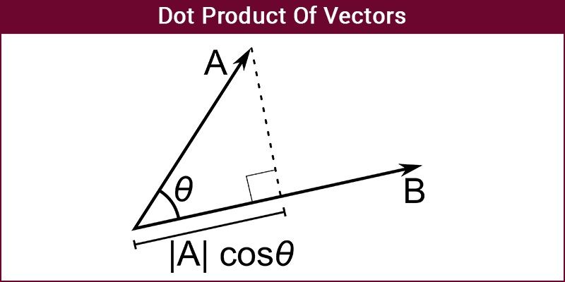

# ***Dot Product***
'''
   #include<iostream>
   #include<vector>
   using namespace std;
   double dotProduct(const vector<double>&A , const vector<double>& B)
   {
       double result=0.0;
       for(int i=0 ; i<A.size() ; i++)
       {
           result += A[i]*B[i];
       }
   return result;
   }
   int main()
   {
       vector<double>A={1.0, 2.0, 3.0};
       vector<double>B={4.0, 5.0, 6.0};
       double result = dotProduct(A, B);
       cout<<result<<endl;
   }
'''
>Methametical Expression
$$ \mathbf{A} \cdot \mathbf{B} = \sum_{i=1}^{n} A_i B_i $$

### Link
[Google](https://www.google.co.in)

###Lists
1. AT 90 degree dot product is 0
2. At 0 degree dot product is maximum
3. At 180 degree dot product is minimum

>[!NOTE]
> Magnitute of vectors is always positive

### Table of time complexity
|----------------------|-----------------|------------------|
|        Version       | Time Complexity | Space Complexity |
|----------------------|-----------------|------------------|
|      Basic loop      |       O(n)      |       O(1)       |
|----------------------|-----------------|------------------|
| Parallel Computation |     O(log n)    |       O(1)       |
|----------------------|-----------------|------------------|

### Image

### Footnotes
[^1] This all about vector dot product
